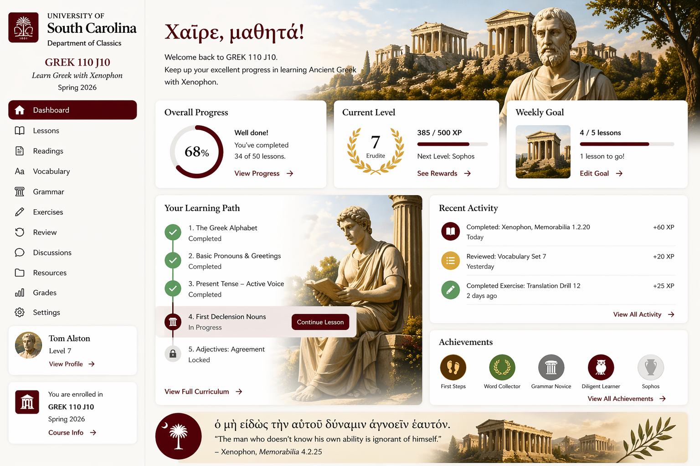

# Dashboard Visual Reference

Added: 2026-04-23

This file stores the current visual reference mockup for the course dashboard so we can keep future UI work aligned with the intended direction.

Reference image:

What this mockup is helping define:

- USC and Classics branding anchored in the left sidebar
- Warm parchment-and-garnet palette with elegant serif emphasis
- A wide, image-rich hero area with Greek greeting and course-specific messaging
- Compact summary cards across the top for progress, level, and weekly goal
- A split main content area for learning path and recent activity
- A lower-band quote treatment that feels integrated with the visual identity

How to use this reference:

- Treat it as a visual target, not a frozen pixel-perfect requirement
- Keep functional behavior aligned with the broader project documents
- Recheck this mockup before major dashboard layout or styling changes

Related project documents:

- [Project specification](../../docs/project-spec.md)
- [Ideas and brainstorming](../../docs/ideas.md)
